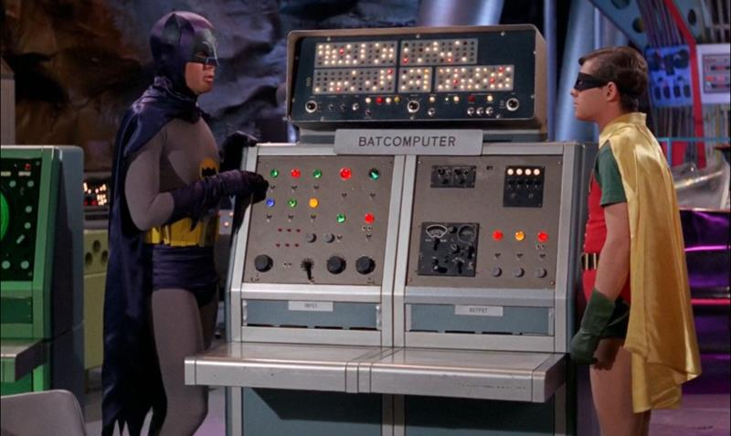
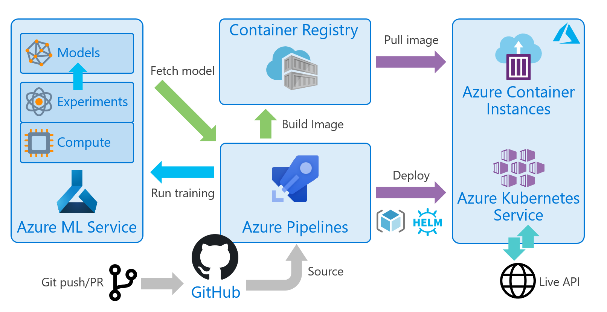

# Project Batcomputer
Project Batcomputer is a working example of DevOps applied to machine learning and the field of AI

Motivations for this project:
- Understand the challenges in operationisation of ML models
- Attempt to make a reality of “DevOps for AI” 
- Integration of "closed box" processes (e.g. *Azure ML Services*) with real DevOps approach


**💬 Why "Project Batcomputer"?**  
The main model trained and used as the foundation of the project is based on crime data, and predictions of outcomes of crimes (convictions etc). The [Batman Batcomputer](https://en.wikipedia.org/wiki/Batcomputer) seemed like a fun way to make using such a prediction model more interesting. 

{: .framed}

Some of the main technology themes:
- Continuous integration & deployment with *Azure Pipelines*
- Wrapper app that allows the model to be run as a RESTful web API
- Use of *Azure ML Service* and Python SDK
- Training Python notebooks that carry out the machine learning using Scikit-Learn 
- Infrastructure as code deployments into *Azure*
- Use of containers and Kubernetes

## Core Building Blocks
This shows a high level view of the core functional aspects of the project
{: .framed .padded}

## Models, Metadata and API Design
It was a design goal of the project not to present a thin wrapper around the scoring function i.e. `model.predict(f)` where a raw array of feature numbers is the expected input to the API. This approach is primitive and not in line with modern RESTful APIs

This project took an approach of not just serializing the trained/fitted model as an output, but also two metadata files
- `lookup.pkl` file provides a means for the data-scientist working on training the model, to pass the encoded labels and features that the model is expecting at scoring time. These take the form of a pickled dictionary with string labels mapping to encoded label numbers
- `flags.pkl` is used correspondingly to providing meaningful names for the results/scores

Using these two files, the model API wrapper has enough information that can present a more RESTful and developer friendly API

For example, rather than:
```
POST /api/predict
{ [27, 19, 10] }
```

Batcomputer API looks like:
```
POST /api/predict
{  
  "force": "Thames Valley Police",
  "crime": "Bicycle theft",
  "month": 10
}
```

## Repo Structure
The project doesn't represent a single codebase, there are multiple sets of artifacts, configuration files and sourcecode held here. The top level folders are as follows:
```
/aml         - Azure ML Service orchestration scripts (Python)
/assets      - Art and stuff
/azure       - Azure ARM templates & scripts
/batclient   - Frontend web client of Batcomputer to demo the model API
/data        - Source training data
/docs        - Documentation & guides 
/kubernetes  - Kubernetes, Helm charts to deploy the wrapper API into Kubernetes
/model-api   - Source for Python model wrapper API 
/pipelines   - Azure DevOps pipelines 
/tests       - Postman collection for API testing
/training    - Training Python notebooks
```

## Setup
If you wish to setup this project in your own Azure subscription, a full guide is provided  
**⚡ Important!**  
It is strongly advised to fork this repo to your own GitHub account before proceeding, and then clone it. For the DevOps CI flows this is a requirement as webhooks and other git configuration is required

#### [📃 Setup Guide](/docs/setup)

## Presentation Deck
REMOVED PENDING UPDATE

## Project Table of Contents
As there are a significant number of components, interactions & products involved in this project. An attempt has been made to break the things into four main sections, and to make those sections as standalone as possible:

- [DevOps CI/CD automation & pipelines](#devops-cicd)
- [Model training & machine learning](#machine-learning--training)
- [Wrapping the model in an API service](#model-api--wrapper-app)
- [Batcomputer Client](#)

---

# DevOps CI/CD
The core of this project is focused on DevOps, and the practices of 'Continuous Integration' (CI), 'Continuous Deployment' (CD) & 'Infrastructure As Code' (IaC). In essence these are sets of automated "pipelines" or sets of tasks that drive the process of training the models, building the API and deploying that into Azure

*Azure DevOps Pipelines* (or simply *Azure Pipelines*) gives us the means to create and run these pipelines, and the likes of 

For runtime and hosting of the API, containers are used and two services were selected, *Azure Container Instances* for simple standalone deployments, and *Azure Kubernetes Service* for demonstrating the deployment into Kubernetes

## Technology Stack
- [Azure DevOps Pipelines](https://azure.microsoft.com/services/devops/pipelines/)
- [Azure Container Registry](https://azure.microsoft.com/services/container-registry/)
- [Azure Resource Manager (ARM) Templates](https://docs.microsoft.com/en-gb/azure/azure-resource-manager/)
- [Helm](https://helm.sh/)
- [Azure Container Instances (ACI)](https://azure.microsoft.com/services/container-instances/)
- [Azure Kubernetes Service (AKS)](https://azure.microsoft.com/services/kubernetes-service/)

## End To End DevOps flow
{: .framed .padded}

## Azure DevOps Pipelines
Azure Pipelines (part of Azure DevOps) is used to provide CI/CD automation. These drive the whole process; data-prep, training and building of the API - plus deployment
#### [📃 DevOps Pipelines - Docs](/pipelines)

## Infrastructure as Code

ARM Template(s) for standing up the wrapper API app using Azure Container Instances
#### [📃 ARM Template - Docs](/azure/aci-arm-template)

A Helm chart will deploy the wrapper model API app and configure a Kubernetes Ingress to route traffic to it.
#### [📃 Helm Chart - Docs](/kubernetes/helm)

---

# Machine Learning & Training
The primary focus of this project is on the operationisation aspects of machine learning, rather than the actual machine learning and the models themselves. In fact from the perspective of the model-api app and the CI/CD deployment flows the quality of the model and how it was trained & created is irrelevant

Two ML use cases are provided; one for Batcomputer (based on the crime data described above) and one for the well known "would you survive the Titanic?" used in many ML training examples

The scripts for training can either be run locally, or run within Azure ML Service as a experiment

**⚡ Important!**  
The provided code has been written by someone learning ML and trying it for the first time. It was not developed by a data scientist or someone with a background in AI. It does not represent any sort of best practice or exemplary way of training a classifier model with Scikit/Python or analyzing the data. However it is functional, and the resulting models serves the purposes of this project adequately 

If your main interest is in the ML and training side of things, I suggest you look elsewhere, there are thousands of excellent resources available on this topic

## Technology Stack
- [Azure Machine Learning Service](https://docs.microsoft.com/en-gb/azure/machine-learning/service/)
- [Python 3](https://www.python.org/)
- [Scikit-Learn](https://scikit-learn.org/stable/)
- [Pandas](https://pandas.pydata.org/)

## Use of Azure ML Service
*Azure Machine Learning service* (*Azure ML* or AML) provides SDKs and services to prep data, train, and deploy machine learning models. AML has a complete end to end workflow, including operationalization and deployment, however it skips many of the best practices of DevOps and is in effect "a closed box" and does not take account of CI/CD

For this project AML is only used for training the model and traceability of the experiments runs, the operationalization part is handled outside of AML, using Azure DevOps Pipelines and infrastructure as code

Here we drive AML via a series of 'orchestration scripts', and it's these scripts which are called and executed by *Azure DevOps Pipelines*, these scripts provide much of the glue and integrate the AML process with a true DevOps CI/CD approach

## Full Documentation

#### [📃 Azure ML Orchestration Scripts](/aml)

#### [📃 Scikit Training Scripts](/training)

#### [📃 Source Data](/data)

---

# Model API / Wrapper App
The model API wrapper is a Python *Flask* app, designed to wrap and "serve" the model over a HTTP REST based API. It is standalone, lightweight and designed to run in a container. It consumes the `model.pkl`, `lookup.pkl` and `flags.pkl` files described above, and loads them at runtime

For more details see the full docs below

## Technology Stack
- [Flask](http://flask.pocoo.org/)
- [Gunicorn](https://gunicorn.org/)
- [Pickle](https://docs.python.org/3.6/library/pickle.html)
- [Swagger](https://swagger.io/docs/specification/about/)
- [Python 3](https://www.python.org/)

## Full Documentation
#### [📃 Model API - Full Docs](/model-api)
