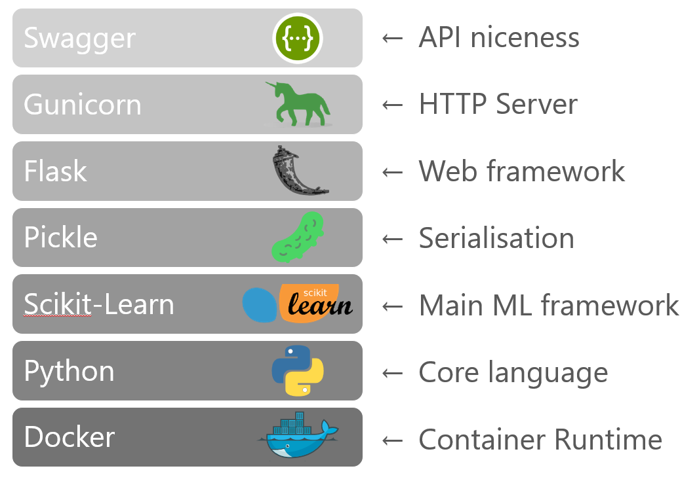

# Project Batcomputer
Project Batcomputer is a working example of DevOps applied to machine learning and the field of AI

Motivations for this project:
- Understand the challenges in operationisation of ML models
- Attempt to make a reality of “DevOps for AI” 
- Existing processes (e.g. Azure Machine Learning Service) deemed problematic

**💬 Why "Project Batcomputer"?**  
The main model trained and used as the foundation of the project is based on crime data, and predictions of outcomes of crimes (convictions etc). The [Batman Batcomputer](https://en.wikipedia.org/wiki/Batcomputer) seemed like a fun way to make using such a prediction model more interesting. 

{: .framed}

Some of the main themes that make up the project:
- Wrapper app that allows the model to be run as a RESTful web API
- Continuous integration with *Azure Pipelines*
- Training Python notebooks that carry out the machine learning using Scikit-Learn 
- Infrastructure as code deployments into Azure
- Use of containers and Kubernetes

## Core Building Blocks
This shows a high level view of the core functional aspects of the project
{: .framed .padded}

## Model Registry
The integration point between the training and the deployment as the API service app is the "model registry". The training process is expected to output pickled files (i.e. serialized objects) and upload them into *Azure Blob storage*. 

Not only is the model pickled and stored, but two other files are output from the training process and also stored in the blob storage model registry

- **model.pkl** - The main trained Scikit-learn model
- **lookup.pkl** - Mapping parameters/strings to numbers (features) for passing into predict function. This is a dictionary of the encoded labels used in the training
- **flags.pkl** - Maps output of prediction function to human readable strings or labels

The naming convention used in the storage account is:
```
/{model-name}/{model-version}/{file}.pkl
  ↑            ↑               ↑ 
 container    version-prefix   filename   
```

**💬 Why the extra files & complexity?**  
It was a design goal of the project not to present a dumb wrapper around the scoring function i.e. `model.predict_proba(features)` where a raw array of feature numbers is the expected input to the API. The `lookup.pkl` file provides a means for the developer working on training the model, to pass the encoded labels to the app and from there a more human friendly API can be exposed. And `flags.pkl` is used correspondingly to providing meaningful names for the results/scores

## Project Index
As there are a significant number of components, interactions & products involved in this project. An attempt has been made to break the things into three main sections, and to make those sections as standalone as possible:

- [Model training & machine learning in DataBricks](#machine-learning--training)
- [Wrapping the model in an API service](#model-api-service--wrapper-app)
- [DevOps CI/CD automation & pipelines](#devops-cicd)

## Repo Structure
The project doesn't represent a single codebase, there are multiple sets of artifacts, configuration files and sourcecode held here. The top level folders are as follows:
```
/assets      - Art and stuff
/azure       - Azure ARM templates
/batclient   - Frontend web client of Batcomputer to demo the model API
/data        - Source training data
/databricks  - Configuration files and info for setting up DataBricks
/docs        - Documentation & guides 
/kubernetes  - Kubernetes configurations
 └ helm      - Helm charts to deploy the wrapper API into Kubernetes
/model-api   - Source for Python model wrapper API 
/notebooks   - Training Python notebooks, synced with DataBricks via git
/devops      - Scripts, pipelines and docs relating to CI/CD
 └ pipelines - Azure DevOps Pipelines 
```

## Working With This Project
**⚡ Important!**  
It is strongly advised to fork this repo to your own GitHub account before proceeding, and then clone it.  
For the DevOps CI flows this is a requirement as webhooks and other git configuration is required

## Presentation Deck
[Full background and documentation can be found in the provided slides](docs/Project-Bat-Computer-Slides.pdf)  
(Work in progress)

---

# Machine Learning & Training
The primary focus of this project is on the operationisation aspects of machine learning, rather than the actual machine learning and the models themselves. In fact from the perspective of the model-api app and the CI/CD deployment flows the quality of the model and how it was trained & created is irrelevant

Two ML use cases are provided; one for Batcomputer (based on the crime data described above) and one for the well known "would you survive the Titanic?" used in many ML training examples

All the training was developed and tested in Azure DataBricks using Python Notebooks. Spark was not heavily leveraged so the Notebooks could be ported elsewhere without major changes

**⚡ Important!**  
The provided code has been written by someone learning ML and trying it for the first time. It was not developed by a data scientist or someone with a background in AI. It does not represent any sort of best practice or optimal way of training a ML model with Scikit/Python or analyzing the data. However it is functional, and the resulting models serves the purposes of this project adequately 

If your main interest is in the ML and training side of things, I suggest you look elsewhere, there are thousands of excellent resources available on this topic

## Technology Stack
- [Azure DataBricks](https://azure.microsoft.com/en-gb/services/databricks/)
- [Python 3]((https://www.python.org/))
- [Scikit-Learn](https://scikit-learn.org/stable/)
- [PySpark](https://spark.apache.org/docs/2.2.1/api/python/pyspark.html)

## Full Documentation

#### [📃 DataBricks Setup](/databricks)

#### [📃 Python Notebooks](/notebooks)

---

# Model API service / Wrapper App
The model API wrapper is a Python Flask app, designed to wrap the model with a REST based API. It is standalone, lightweight and designed to run in a container

## Technology Stack
{: .framed .padded}

## Full Documentation
#### [📃 Model API service - Full Docs](/model-api)

---

# DevOps CI/CD

{: .framed .padded}

## Azure DevOps Pipelines
Azure Pipelines (part of Azure DevOps) is used to provide CI/CD automation. These carry out the Docker build of the model API image and also integrates with DataBricks for running the training jobs via a CI trigger
#### [📃 DevOps Pipelines - Full Docs](/devops)

## Infrastructure as Code

This Helm chart will deploy the wrapper model API app and configure a Kubernetes Ingress to route traffic to it.
#### [📃 Helm Chart - Full Docs](/kubernetes/helm)

ARM Template(s) for standing up the wrapper API app using Azure Container Instances
#### [📃 ARM Templates - Full Docs](/azure)
