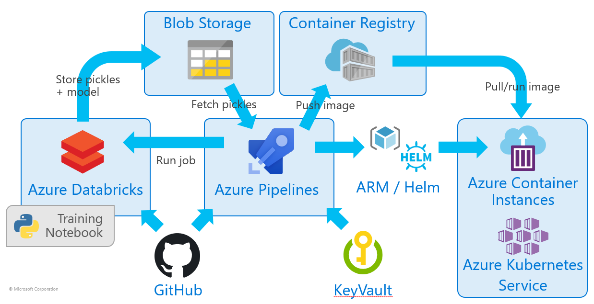

# Project Batcomputer
Project Batcomputer is a working example of DevOps applied to machine learning

Motivations for this project:
- Understand the challenges in operationisation of ML models
- Attempt to make a reality of “DevOps for AI” 
- Existing processes (e.g. Azure Machine Learning Service) deemed problematic

Why "Project Batcomputer"? The main model trained and used as the foundation of the project is based on crime data, and predictions of outcomes of crimes (convictions etc). The [Batman Batcomputer](https://en.wikipedia.org/wiki/Batcomputer) seemed like way to make such a prediction model more fun and interesting. 

Some of the main themes that make up the project:
 - Training Python notebooks that carry out the machine learning using Scikit-Learn 
 - Wrapper app that allows the model to be run as a RESTful web API
 - Continuous integration with *Azure Pipelines*
 - Infrastructure as code based deployments into Azure
 - Used of containers and Kubernetes

## Automation Flow
A high level flow of the train, build & deploy process is shown here


## Model Registry
The integration point between the training and the deployment as the API service app is the "model registry". The training process is expected to output pickle files and upload them into *Azure Blob storage*. 
- **model.pkl** - The main trained Scikit-learn model
- **lookup.pkl** - Mapping parameters/strings to numbers (features) for passing into predict function
- **flags.pkl** - Maps output of prediction function to human readable strings or labels

The naming convention used in the storage account is:
```
/{model-name}/{version}/*.pkl
```
Where `{model-name}` is a Blob storage container for the model, e.g. "bactcomputer" and `{version}` is our version string as a virtual directory, e.g. "1.0.0"


## Project Index
As there are a significant number of components, interactions & products involved in this project. An attempt has been made to break the things into standalone sections:

- [Model training & machine learning in DataBricks](#machine-learning)
- [Wrapping the model in an API service](#model-api-service--wrapper-app)
- [DevOps CI/CD automation & pipelines](#devops-cicd)
- [Complete end to end flow](#end-to-end-flow)

## Repo Structure
The project doesn't represent a single codebase, there are multiple sets of artifacts, configuration files and sourcecode held here. The top level folders are as follows:
```
/assets     - Art and stuff
/azure      - Azure ARM templates
/batclient  - Frontend web client of Batcomputer to demo the model API
/data       - Source training data
/databricks - Configuration files and info for setting up DataBricks
/docs       - Documentation & guides 
/kubernetes - Kubernetes configurations
 └ helm     - Helm charts to deploy the wrapper API into Kubernetes
/model-api  - Source for Python model wrapper API 
/notebooks  - Training Python notebooks, synced with DataBricks via git
/pipelines  - Azure DevOps Pipelines
```

### Presentation Deck
[Full background and documentation can be found in the provided slides](docs/Project-Bat-Computer-Slides.pdf)  
(Work in progress)

---

# Machine Learning & Training

## Technology Stack
- [Azure DataBricks](https://azure.microsoft.com/en-gb/services/databricks/)
- [Python 3]((https://www.python.org/))
- [Scikit-Learn](https://scikit-learn.org/stable/) (For training)
- [PySpark](https://spark.apache.org/docs/2.2.1/api/python/pyspark.html)

## Source Code
Source code of the Python notebooks [are provided here](/notebooks)

---

# Model API service / Wrapper App

## Technology Stack
- [Swagger](https://swagger.io/)
- [Flask](http://flask.pocoo.org/)
- [Pickle](https://docs.python.org/3/library/pickle.html)
- [Scikit-Learn](https://scikit-learn.org/stable/) (For scoring only)
- [Python 3](https://www.python.org/)
- [Docker](https://www.docker.com/)
- [Gunicorn](https://gunicorn.org/)

## Local Development
If you want to build locally you will need Python 3.6 and/or Docker. These steps all assume the model pickle files have already been trained and pushed into Blob storage (by the training job/Notebook) for the corresponding version you are trying to run and build

You must work from the `/model-api` directory not the root of the project

Create a `.env` file based from a copy of the provided `.env.sample` and configure the values as per your environment

- Set the model version you are working to in the `.env` file as described above
- Run `./scripts/get-pickles.sh` to fetch the pickle files to your local system

## Running Directly in Python
- Create Python virtual environment `python3 -m venv pyvenv`
- Activate virtual environment `source ./pyvenv/bin/activate`
- Install requirements `pip3 install -r requirements.txt`
- Run `python3 src/server.py`

## Building Container Image
Manually building and tagging the container locally is done as follows:

- Carry out the steps in [Local Development](#local-development) above
- `docker build . -f Dockerfile -t batcomputer-api`
- `docker run -p 8000:8000 batcomputer-api`

## Wrapper App API
The wrapper app dynamically creates a Swagger definition from the provided `lookup.pkl` and `flags.pkl` files, so in effect it is a generic app that could wrap any Scikit-Learn model. The Swagger definition provides guidance to callers of the predict API on what parameters are expected and allowed values in the request 

API and routes exposed by the app are:
- **GET** `/api/info` - Return simple status as JSON, for status checking
- **GET** `/api/docs` - Swagger UI
- **GET** `/swagger.json` - Base Swagger definition file describing the API
- **POST** `/api/predict` - Payload body should be JSON, will return prediction response in JSON. See the Swagger file for example payload
- **GET** `/api/predict/params` - Return a list of parameters to invoke the predict API. The parameters names and possible values are returned (as an array of acceptable strings). If a parameter accepts a number rather than a string then `0` will be shown
e.g.
```
GET /api/predict/params
{
  "gender": [ "male", "female" ],
  "age: 0
  "location": [ "London", "New York", "Bognor Regis" ]
}
```

---

# DevOps CI/CD

## Azure DevOps Pipelines
YAML pipelines [are provided](/pipelines) for both the build of the API wrapper app and, running training job in Databricks (should you require it)

## Infrastructure as Code - Helm Chart
[Included is a Helm chart to deploy into Kubernetes](/kubernetes/helm). This will deploy the wrapper API app and configure an Ingress to route traffic to it

## Infrastructure as Code - ARM Templates
ARM Template for standing up the wrapper API app using Azure Container Instances, is in the [azure folder](/azure)

---

# End To End Flow

## Blah
Yesy
