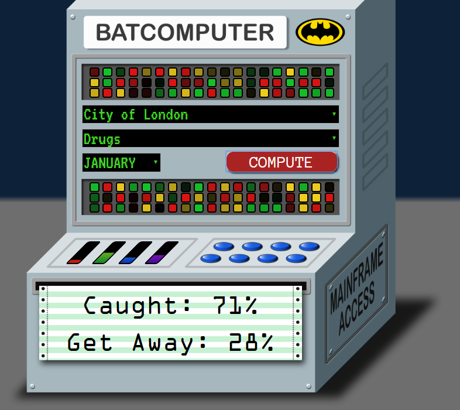

# Batclient

This is a demo frontend for the Batcomputer model, which looks a bit like the Batcomputer from the 1960 TV show

It is a completely standalone, static JavaScript & HTML5 app, it can be run simply by opening the `batclient/index.html` file locally or from the GitHub Pages hosted copy

The app makes use of many recent CSS3 features such as animations, and has been written targeting the Chrome browser. Edge/Firefox will work but some features such as will be missing or look strange

On start you will be prompted for the API endpoint URL, as the "connection to the mainframe" (this URL must end /api). After connecting you can then select a region, a crime and a month - and have Batcomputer use the model to predict the chances of getting caught for the crime.

### [Batcomputer Client - GitHub](http://batcomputer.benco.io/batclient/)

