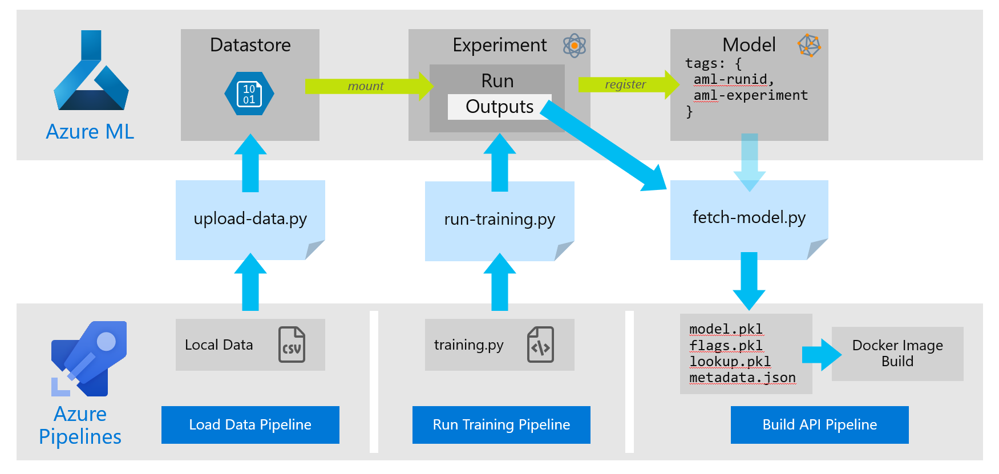
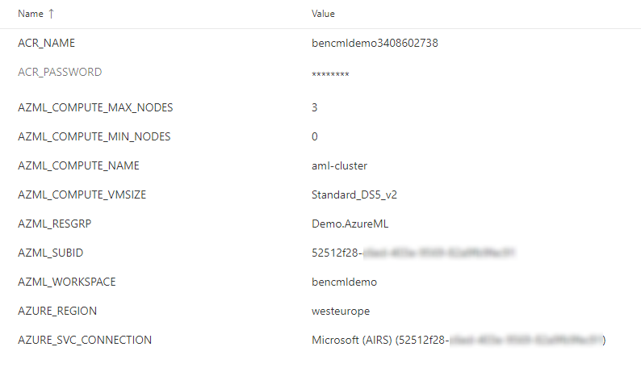

# Azure DevOps Pipelines
Azure Pipelines is a cloud service that you can use to automatically build and test any code project and make it available to other users. It works with just about any language or project type.  
Azure Pipelines combines continuous integration (CI) and continuous delivery (CD) to constantly and consistently test and build your code and ship it to any target.

# Build Pipelines
There are three pipelines; **data-load**, **training**, **build-api** for each model to be trained and deployed, one set for the 'Batcomputer' crime model, the other for 'Titanic'
```
batcomputer-build-api.yml
batcomputer-data-load.yml
batcomputer-training.yml
titanic-build-api.yml
titanic-data-load.yml
titanic-training.yml
```

All of the pipelines are in the newer Azure Pipelines YAML format.  
The pipelines must be run on a Linux build agent, e.g. the **Hosted Ubuntu 1604** agents

### Pipelines Flow


## Variables
The pipelines all make heavy use of variables. A [variable group](https://docs.microsoft.com/azure/devops/pipelines/library/variable-groups) called `shared-variables` is referenced by all pipelines and that should hold all common variables and secrets. There is no scriptable way to create this variable group currently, so it will need to be done manually 

| Variable             | Use                                                                                        |
| -------------------- | ------------------------------------------------------------------------------------------ |
| AZURE_SVC_CONNECTION | Name of the service connection from Azure DevOps to Azure                                  |
| AZML_*               | The various AML script variables, some of these are set per-pipeline, others remain common |

### Variable Group: shared-variables 
A fully populated `shared-variables` group in the *Pipelines Library* should look something like this. Make sure the "Allow access to all pipelines" option is enabled. 



All of the build pipelines call one of AML orchestration scripts as described in the [AML script documentation](../aml). 
The steps to do this are always the same in all of the pipelines:
- **Use Python 3.6**
  - Simply tell the build agent to use Python 3.6
- **Install Python package requirements with PIP**
  - Run `pip install -r aml/requirements`
- **Run AML script**
  - Runs `python <<script>>.py`
  - ⚡ Note! This step is run as an 'Azure CLI' task. This might seem an unusual way to run a Python script but it provides a convenient way to authenticate with Azure. The Azure ML SDK will use Azure CLI credential tokens if it finds them, so using this task omits the need to setup a dedicated service principal

## Pipeline: data-load.yml
First the zipped data is fetched from Blob storage with wget.

Then runs the `upload-data.py` AML script, required environmental variables are set to run the script as outlined in the [AML script documentation](../aml) and calls the script with a corresponding `--data-dir` argument

**Trigger:** None

## Pipeline: run-training.yml
This runs the `run-training.py` AML script, required environmental variables are set to run the script as outlined in the [AML script documentation](../aml). As this is a pipeline that calls a script, which in turn runs another script up in AML, it can be confusing. 

For clarity:
- The AML Python script `aml/run-training.py` ***runs inside the Azure DevOps build agent***, but the actual training is not taking place there.
- `AZML_SCRIPT` The Python training script located in the `training/` directory, that will be executed by AML, ***runs on the remote compute cluster in Azure ML***

**Trigger:** CI trigger, on code changes to: training/scikit-batcomputer.py, pipelines/batcomputer-training.yml & aml/run-training.py

## Pipeline: build-api.yml
This runs the `fetch-model.py` AML script, required environmental variables are set to run the script as outlined in the [AML script documentation](../aml), no arguments are passed so the script will always fetch the latest model.

After this two more steps are carried out:
- Runs `docker build` from the staged `model-api` directory and tag the image to be placed into ACR
- Runs `docker login` and `docker push` to push the new image up to ACR

**Trigger:** Dependency triggered after run-training pipeline, also CI trigger, on code changes to: model-api/*, pipelines/batcomputer-build-api.yml

# Release Pipelines
This section is on hold until YAML release pipelines are supported by Azure DevOps.  

At this stage it is left as an exercise for the reader!
